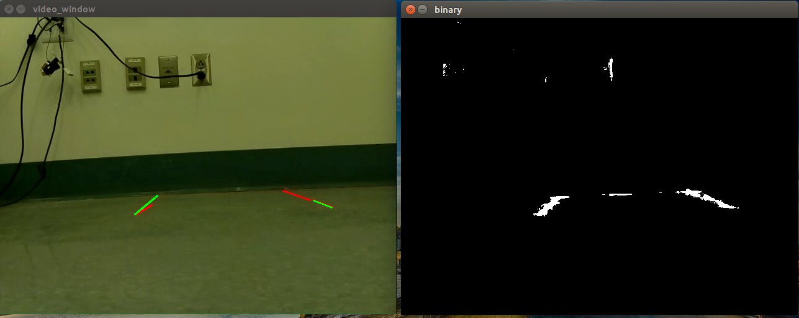
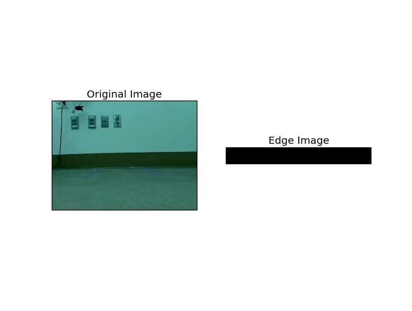
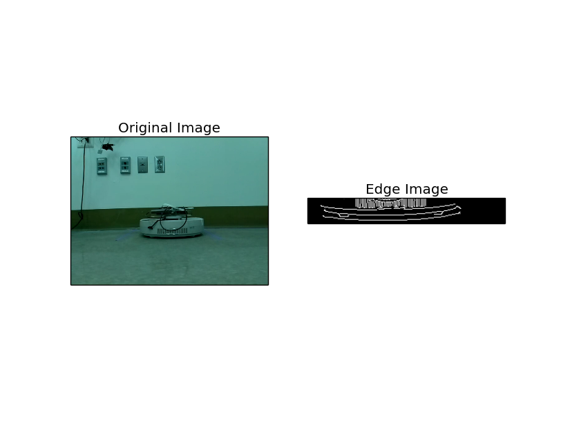
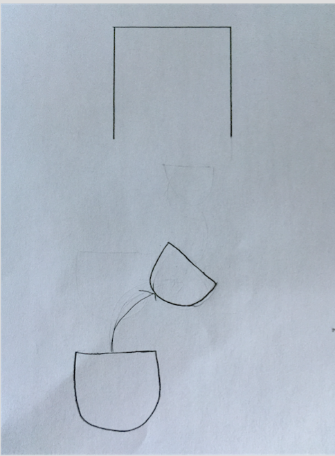
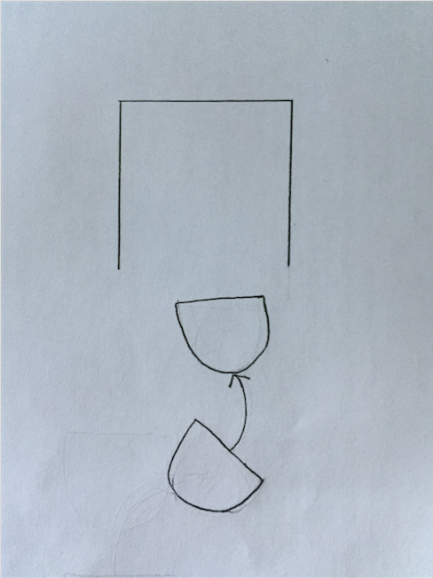
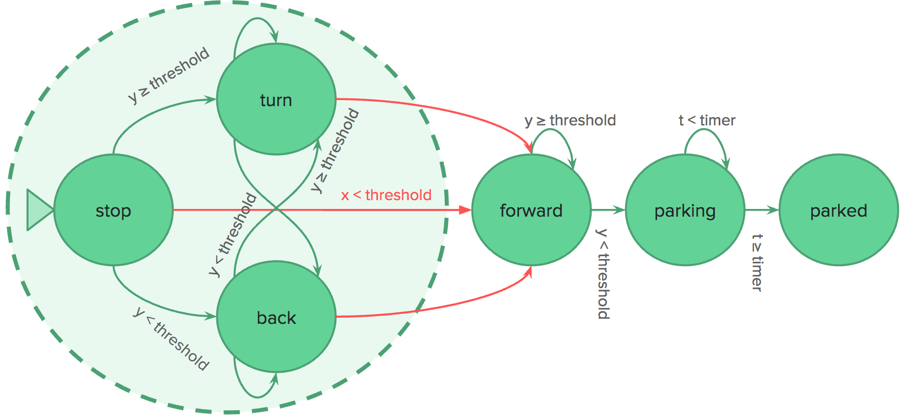
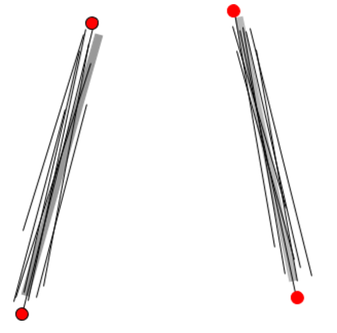

# Neato Computer Vision Parking
Kim Asenbeck, Jason Lan, Jordan Van Duyne

## Project Goal
We are interested in developing a computer vision algorithm to autonomously park a “vehicle.” Our plan is to program a Neato to identify an open parking spot and navigate into the spot.

## Videos

https://www.youtube.com/watch?v=geigUN9vyXQ
https://www.youtube.com/watch?v=1slSgLVTuV4
https://www.youtube.com/watch?v=HQJLs_dqFwY
https://www.youtube.com/watch?v=4AjAjaIdMoo
https://www.youtube.com/watch?v=R3aok6OM1jI

## System description: basic components and algorithms

Above is a typical workflow for the system. The script first uses a HSV color filter to filter out the lines for the spot. Then it performs hough line detection algorithm to find the left and right delineators of the nearest spot. For each point in the image, the hough line detection algorithm defines a function in polar system coordinate for the family of lines that goes through that point. Then it finds the intersection of all those points and those are the lines in the image.

After the parking spot delineators are found, the script crops the area between the lines and runs Canny edge detection on the spot to determine whether the spot in front of the robot is empty. Below is the results of edge detection in an empty spot and occupied spot.

If the spot is empty, the robot will convert the spot location into real world 3d position via the pinhole camera model and align itself to the spot and park itself. Otherwise, the script alerts the user that the spot is unavailable and exits.

## Design decision: how to mimic a car's movements
A Neato’s drive train is less restrictive than a car’s. For example, a Neato can spin in place but a car cannot.  As such, we had to limit the Neato’s movements to mimic those of a car.

The biggest problem that this presented was that in order to successfully park, the Neato first had to situate itself right in front of the spot, centered horizontally relative to the spot while facing the spot, so that it could simply drive forward into the spot without entering any of the adjacent spots.

Although this concept is simple, actually navigating to this position from a starting location is difficult. For a human driving a vehicle, driving into a spot can consist of natural feeling readjustments determined through trial and error and best judgement. However, a Neato is preprogrammed to behave a certain way, so mimicking this “natural” process of readjustment is achieved through a set of constraints and predetermined movements. For example, take the following scenario:

The Neato has to move to its right to be properly aligned with the spot. Yet, like a car, it can only do so by driving forward and turning at the same time.

However, after making this turn, the Neato is now facing to the right, not towards the spot! Thus, the Neato has to turn back to the left while moving forward.

A third challenge that arises from the Neato’s restricted movements is that, since a Neato can only turn while also moving forward, if the Neato is too close to the spot, there is no room for readjustment, so it has to back up.

Thus, in order to solve these challenges, we implemented an finite state machine, along with set actions to take for each given state, that, as a whole, is a “sub-state” of our overall finite state machine (explained further below). This large "sub-state" is comprised of the states in the dashed lines in the diagram below.

First, the Neato checks if it is within a certain threshold of being centered horizontally. If it is centered, great, it is properly aligned! If not, we then check if the robot is within a certain vertical distance to the spot. If it is too close, it backs up straight, no matter how off-center it is horizontally. Once the Neato is far enough from the spot, it moves forward and turns for a set amount of time, with forward and angular velocities proportional to how off center it is horizontally. Then, it turns in the opposite direction for a set amount of time, again with forward and angular velocities proportional to how off centered it was before the first turn, allowing it to be facing the spot once again. Then, it recalculates how off center it is.

## Code structure
We structured our code into two modules, recognizer and park. The recognizer script is responsible for spot detection, checking if spot is empty and passing the valid spot position to the park script.

In the park script we used a finite state machine to control the behavior of the robot. Possible status for the robot are NOT_ALIGNED, ALIGNED, PARKING and PARKED. The robot starts with the default status NOT_ALIGNED. Based on the distance to the spot in X and Y direction, the script directs the Neato the edge of the spot with proportional control, switching the status to ALIGNED. Then the robot will proceed 2x robot length to park inside the spot.

## Challenges
Our parking problem is a combination of sub-problems, each which presented its own mini challenges.

### Identifying a spot
In order to find a spot, we used computer vision, specifically the Hough line transform, to identify parking spot lines.  However, this algorithm returned clusters of several lines, rather than the single lines we expected. In order to find the endpoints that most accurately represented our parking spot, we scanned the image from left to right, seeking the highest and lowest endpoints of each of the parking spot delineators.

### Pin hole camera model
Converting a pixel of an image, for instance, the pixel location of the center of the outer edge of the spot, to a 3D location relative to the Neato’s base line coordinate system was difficult. We did so using the pin hole camera model.

## Tuning parameters
We used proportional control to figure out by how much and how quickly the Neato should turn to better align itself. Instead of having the Neato turn back in the opposite direction after turning to better align itself, we were originally planning on calculating the Neato's angle towards the spot by using the difference between the x values of the two endpoints of one of the lines of a parking spot. However, this difference always ended up being so small and largely affected by noise that this idea was infeasible.

As a result, we had to implement our turn-and-turn back idea. However, this required a lot of proportional control (tuning the forward and angular velocities of both the first and second turns), and thus a number of constants: one for each of these four velocities. Changing one constant greatly affected how well an "overall turn" (both the turn and the turn back) would align the Neato. So, we spent a lot of time tuning these parameters through trial and error, until we were confident enough that we had found values that would work on multiple different Neatos and multiple starting positions.

## Future improvements, given more time

- More parking modes (parallel parking, back-in and etc.)
- Recognizing and obeying parking restrictions based on signs, such as handicapped, reserved, no parking and etc.
- Better algorithm for detecting a spot and moving towards the spot.

## Interesting lessons learned
Upon first considering out project topic, our team easily thought of many extensions we could implement. Examples include real-life parking scenarios, such as reverse parking, parallel parking, equipping a Neato with multiple cameras to allow for multiple possible starting positions, and having the Neato determine whether a spot was “reserved” if it was marked by a sign. While being excited about our project was good, we needed to focus on implementing our MVP and adding extra features incrementally. We did create an outline of a schedule for our MVP, but we would have benefitted from further fleshing out this schedule with set feature deadlines. Since we were unfamiliar with many of the topics we dealt with, a more detailed calendar with some wiggle room built into it for unknown problems that might arise, would have helped us to plan out our goals much more effectively.
