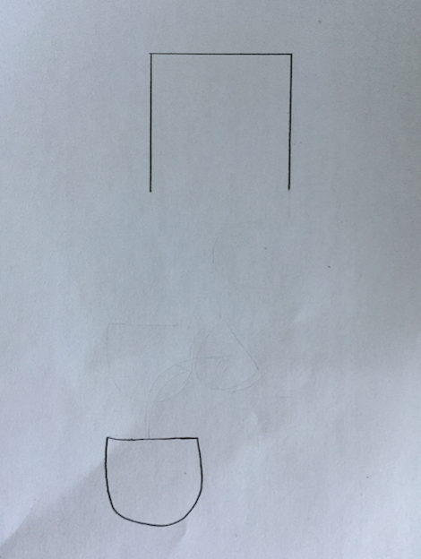

# Neato Computer Vision Parking
Kim Asenbeck, Jason Lan, Jordan Van Duyne

## Project Goal
We are interested in developing a computer vision algorithm to autonomously park a “vehicle.” Our plan is to program a Neato to identify an open parking spot and navigate into the spot.

## System description: basic components and algorithms

Above is a typical workflow for the system. The script first uses a HSV color filter to filter out the lines for the spot. Then it performs hough line detection algorithm to find the left and right delineators of the nearest spot. For each point in the image, the hough line detection algorithm defines a function in polar system coordinate for the family of lines that goes through that point. Then it finds the intersection of all those points and those are the lines in the image.

After the parking spot delineators are found, the script crops the area between the lines and runs Canny edge detection on the spot to determine whether the spot in front of the robot is empty. Below is the results of edge detection in an empty spot and occupied spot.

[pics for edge detection]

If the spot is empty, the robot will convert the spot location into real world 3d position via the pinhole camera model and align itself to the spot and park itself. Otherwise, the script alerts the user that the spot is unavailable and exits.

## Design decision: how to mimic a car's movements
A Neato’s drive train is less restrictive than a car’s. For example, a Neato can spin in place but a car cannot.  As such, we had to limit the Neato’s movements to mimic those of a car.

The biggest problem that this presented was that in order to successfully park, the Neato first had to situate itself right in front of the spot, centered horizontally relative to the spot while facing the spot, so that it could simply drive forward into the spot without entering any of the adjacent spots.

Although this concept is simple, actually navigating to this position from a starting location is difficult. For a human driving a vehicle, driving into a spot can consist of natural feeling readjustments determined through trial and error and best judgement. However, a Neato is preprogrammed to behave a certain way, so mimicking this “natural” process of readjustment is achieved through a set of constraints and predetermined movements. For example, take the following scenario:

The Neato has to move to its right to be properly aligned with the spot. Yet, like a car, it can only do so by driving forward and turning at the same time.

However, after making this turn, the Neato is now facing to the right, not towards the spot! Thus, the Neato has to turn back to the left while moving forward.

A third challenge that arises from the Neato’s restricted movements is that, since a Neato can only turn while also moving forward, if the Neato is too close to the spot, there is no room for readjustment, so it has to back up.

Thus, in order to solve these challenges, we implemented an finite state machine, along with set actions to take for each given state, that, as a whole, is a “sub-state” of our overall finite state machine (explained further below). This large "sub-state" is comprised of the states in the dashed lines in the diagram below.

First, the Neato checks if it is within a certain threshold of being centered horizontally. If it is centered, great, it is properly aligned! If not, we then check if the robot is within a certain vertical distance to the spot. If it is too close, it backs up straight, no matter how off-center it is horizontally. Once the Neato is far enough from the spot, it moves forward and turns for a set amount of time, with forward and angular velocities proportional to how off center it is horizontally. Then, it turns in the opposite direction for a set amount of time, again with forward and angular velocities proportional to how off centered it was before the first turn, allowing it to be facing the spot once again. Then, it recalculates how off center it is.
